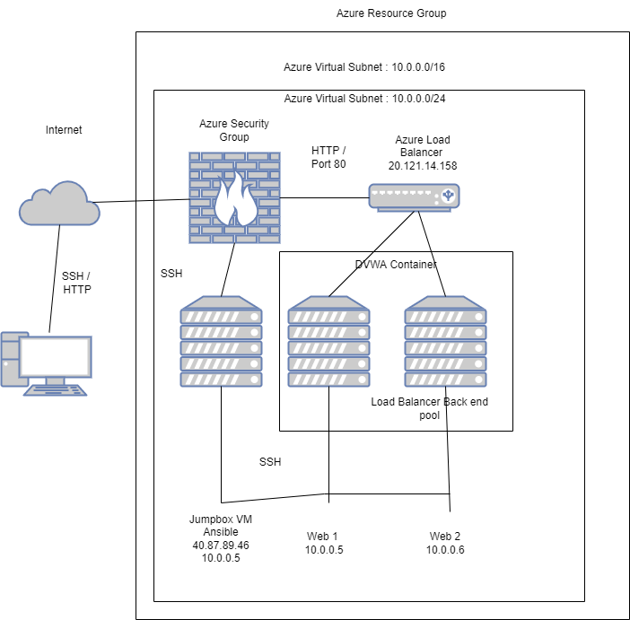
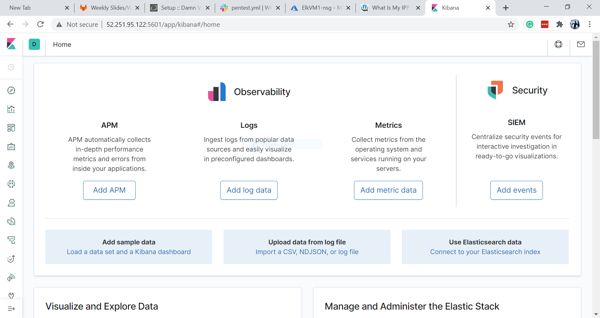

## Automated ELK Stack Deployment

The files in this repository were used to configure the network depicted below.
Network Diagram:

(Ansible/elkplaybook.yml) (Ansible/filebeat-playbook.yml) (Ansible/metricbeat-playbook.yml) 

These files have been tested and used to generate a live ELK deployment on Azure. They can be used to either recreate the entire deployment pictured above. Alternatively, select portions of the playbook file may be used to install only certain pieces of it, such as Filebeat.

  - ---
- name: Configure Elk VM with Docker
  hosts: elk
  remote_user: azureuser
  become: true
  tasks:
    - name: Install docker.io
      apt:
        update_cache: yes
        force_apt_get: yes
        name: docker.io
        state: present

    - name: Install python3-pip
      apt:
        force_apt_get: yes
        name: python3-pip
        state: present

    - name: Install Docker module
      pip:
        name: docker
        state: present

    - name: Increase virtual memory
      sysctl:
        name: vm.max_map_count
        value: 262144
        state: present
        reload: yes

    - name: download and launch a docker elk container
      docker_container:
        name: elk
        image: sebp/elk:761
        state: started
        restart_policy: always
        published_ports:
          -  5601:5601
          -  9200:9200
          -  5044:5044
    - name: Enable service docker on boot
      systemd:
        name: docker

This document contains the following details:
- Description of the Topology
- Access Policies
- ELK Configuration
- Beats in Use
- Machines Being Monitored
- How to Use the Ansible Build

### Description of the Topology

The main purpose of this network is to expose a load-balanced and monitored instance of DVWA, the D*mn Vulnerable Web Application.

Load balancing ensures that the application will be highly available, in addition to restricting in-bound access to the network.
- A load balancer intelligently distributes traffic from clients across multiple servers without the clients having to understand how many servers are in use or how they are configured. Because the load balancer sits between the clients and the servers it can enhance the user experience by providing additional security (DoS attack counter), performance, and resiliency. 

Integrating an ELK server allows users to easily monitor the vulnerable VMs for changes to the jumpbox provisoner and system network.
-Filebeat monitors the log files or locations that you specify on a system, collects log events, and forwards them to either ElasticSearch or LogStash for indexing.
-Metricbeat takes the metrics and statistics that it collects and ships them to output you specify, ElasticSearch or LogStash.

The configuration details of each machine may be found below:

| Name     | Function | IP Address | Operating System |
|----------|----------|------------|------------------|
| Jump Box | Gateway  | 40.87.89.46|   Linux          |
| Web One  | WebServer| 20.121.14.158| Linux          |
| Web Two  | WebServer| 20.121.14.158| Linux          |
| ELK VM   |Monitoring| 20.119.228.252| Linux         |

### Access Policies

The machines on the internal network are not exposed to the public Internet. 

Only the jumpbox machine can accept connections from the Internet. Access to this machine is only allowed from the following IP addresses:
-40.87.89.46

Machines within the network can only be accessed by ssh.
JumpBox VM, the private ip address is, 

A summary of the access policies in place can be found in the table below.

| Name     | Publicly Accessible | Allowed IP Addresses |
|----------|---------------------|----------------------|
| Jump Box | Yes                 | 75.89.49.133         |
| Web 1    | No                  | 10.0.0.4             |
| Web 2    | No                  | 10.0.0.5             |
| ELK VM   | Yes                 | 75.89.49.133         |

### Elk Configuration

Ansible was used to automate configuration of the ELK machine. No configuration was performed manually, which is advantageous because...

- One main advantage of of automating configuration with ansible is the simplicity of it. It allows you to write a complex playbook and be able to reuse it for when you need it again.

The playbook implements the following tasks:
- Install docker.io
- Install Python-pip
- Install Docker Container
- Launch docker container: elk
- Command: systcl -w vm.max_map_count=262144

The following screenshot displays the result of running `docker ps` after successfully configuring the ELK instance.

### Target Machines & Beats
This ELK server is configured to monitor the following machines:
-Web 1 (10.0.0.4)
-Web 2 (10.0.0.5)

We have installed the following Beats on these machines:
-Filebeat
-Metricbeat

These Beats allow us to collect the following information from each machine:
-Filebeat monitors log files or locations you specify, collects log events, and forwards them either to Elasticsearch or Logstash for indexing.
-Metricbeat collects metrics from the operating system and from services running on the server

### Using the Playbook
In order to use the playbook, you will need to have an Ansible control node already configured. Assuming you have such a control node provisioned: 

SSH into the control node and follow the steps below:
- Copy the elkplaybook file to /etc/ansible.
- Update the configuration file to include the webservers and Elk VM private IP's.
- Run the playbook, and navigate to Elk VM to check that the installation worked as expected.

- _Which file is the playbook? Where do you copy it? /etc/ansible/file/filebeat-configuration.yml
- _Which file do you update to make Ansible run the playbook on a specific machine? How do I specify which machine to install the ELK server on versus which to install Filebeat on? Edit the etc/ansible/hosts file to add webserver/elkserver IP addresses.
- http://20.119.228.252:5601/app/kibana

Provide the specific commands the user will need to run to download the playbook, update the files, etc.
- ssh azadmin@JumpBox(Public IP)
- sudo docker container list -a (locate your ansible container)
- sudo docker start container (name of the container)
- sudo docker attach container (name of the container)
- cd /etc/ansible/ - ansible-playbook elk.yml (configures Elk-Server and starts the Elk container on the Elk-Server) wait a couple minutes for the implementation of the Elk-Server - cd /etc/ansible/roles/ - ansible-playbook filebeat-playbook.yml (installs Filebeat and Metricbeat) - open a new web browser (http://[your.ELK-VM.External.IP]:5601/app/kibana) This will bring up the Kibana Web Portal - check the Module status for file beat and metric beat to see their data receiving.

** You will need to ensure all files are properly placed before running the ansible-playbooks.
